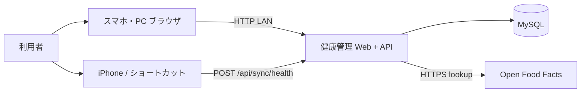

# システムコンテキスト

## 1. システム境界

**健康管理（kenko-kanri）** が担う範囲:

- ダイエット関連データ（食事・体重・体組成・歩数・運動）の記録・集計・表示
- **v3:** カロリー収支（Katch–McArdle + NEAT + TEF）の日次可視化とカード別履歴
- REST API による Web UI からの操作
- iPhone ショートカット経由の Health データ取込

**外部に委ねる範囲:**

- 歩数・体重の計測（iPhone ヘルスケア）
- DNS / ルーティング（自宅 LAN）
- Phase 2: Open Food Facts による食品情報取得 → **v2 で実装対象**

## 2. コンテキスト図

## 3. アクター

| アクター | 説明 | 主な操作 |
|----------|------|----------|
| 利用者（ROLE-001） | 開発者本人 | 食事・運動・体重・体組成の記録、TOP 収支・履歴閲覧、設定変更 |
| iPhone ショートカット | 自動同期エージェント | 日次歩数・任意で体重を API へ POST |

## 4. 外部システム

| システム | 連携目的 | 連携方式（概要） |
|----------|----------|-----------------|
| iPhone ヘルスケア | 歩数・体重・体組成（BMI/LBM/体脂肪率）のソース | ショートカットが読取 → HTTP POST |
| Open Food Facts | バーコード食品情報 | HTTPS REST（**v2**。Pi → OFF。身体データは送信しない） |

## 変更履歴

| 日付 | 変更内容 |
|------|----------|
| 2026-06-13 | 初版作成 |
| 2026-06-13 | v2: OFF 連携を実線化 |
| 2026-06-14 | v3: 健康管理リネーム、体組成同期、散歩記録を境界外（廃止） |
