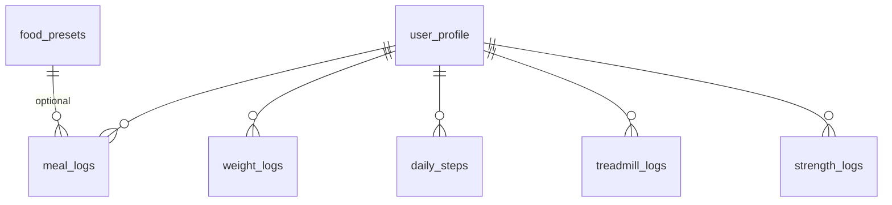
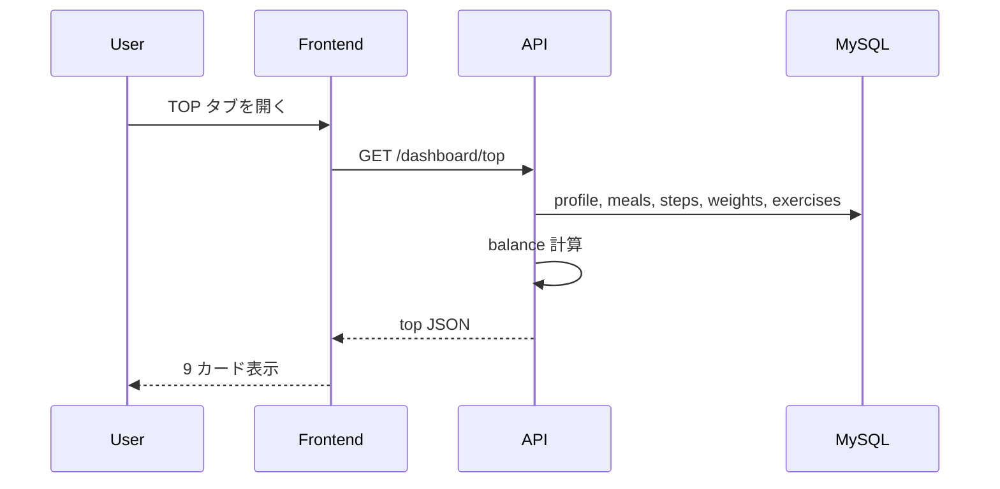
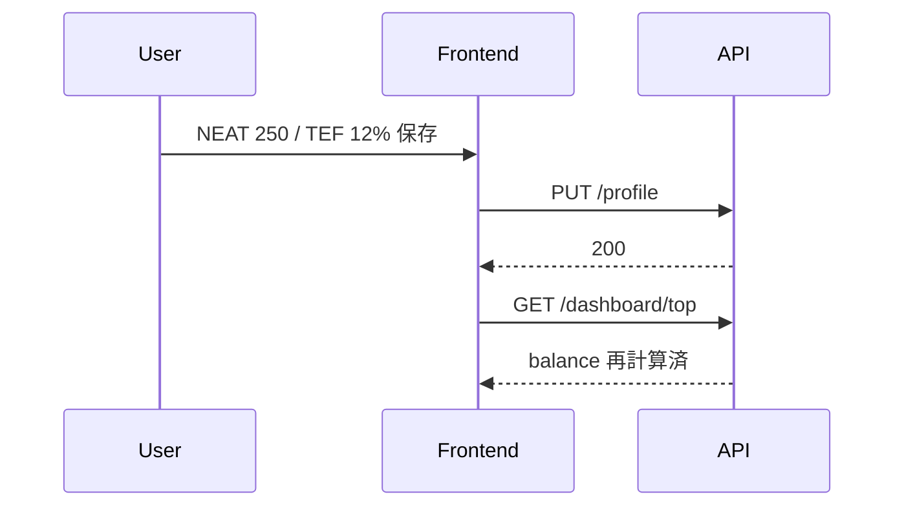
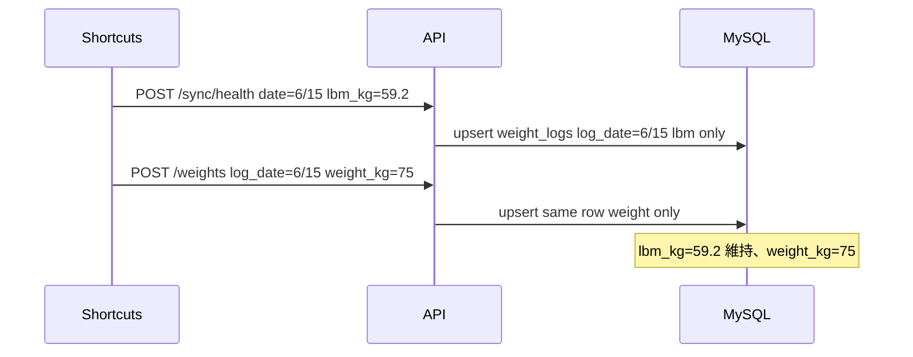

# 詳細設計書: 健康管理 v3 収支ダッシュボード・UI 刷新

## 1. 概要

- **担当ユースケース / モジュール:** Balance, Dashboard, CardHistory, Settings, Frontend Shell（4 タブ UI）。Walks / Summary 廃止
- **担当する要件 ID:** FR-040〜053, FR-001, FR-004, FR-006〜008, FR-010〜013, FR-017〜023, FR-027〜031, FR-036, FR-015, FR-037〜039, FR-050, FR-051
- **要件定義書:** `docs/features/sanpo-ban/requirements.md`
- **基本設計書:** `docs/features/sanpo-ban/basic-design.md` §10
- **デザインシステム:** notion（ライト継続）
- **対象バージョン:** v3
- **前提:** v1-core / v2-barcode 実装をベースに差し替え

**設計判断**

- DB 名を **`kenko_kanri`** に変更。旧 `sanpo_ban` は破棄（人間承認: データ移行なし）
- `walk_sessions` テーブル・walk API は **削除**（v3 一括）
- 目標 kcal/PFC 関連 API・列は **削除**
- 日次集計キャッシュは引き続き **設けない**（v1 DD-004 継続）
- CardHistory は **1 本の汎用 API** + metric パラメータ

## 2. API 設計

ベース URL / プレフィックス / タイムゾーン / 認証: v1-core と同一

### 2.1 エンドポイント一覧（v3 変更）

| メソッド | パス | 概要 | 要件 ID | v3 |
|----------|------|------|---------|-----|
| GET | `/api/v1/profile` | プロファイル取得 | FR-049 | **変更** |
| PUT | `/api/v1/profile` | プロファイル更新・初回設定 | FR-001, FR-004, FR-049 | **変更** |
| POST | `/api/v1/profile/recalculate-targets` | TDEE/PFC 再提案 | — | **削除** |
| GET | `/api/v1/dashboard/today` | 旧今日ダッシュボード | — | **削除** |
| GET | `/api/v1/dashboard/top` | TOP 9 カード + 収支 | FR-041, FR-044, FR-046 | **新規** |
| GET | `/api/v1/dashboard/history/{metric}` | カード別履歴 | FR-045 | **新規** |
| GET | `/api/v1/summary/week` | 週サマリー | — | **削除** |
| GET/POST | `/api/v1/walks` | 散歩 | — | **削除** |
| GET | `/api/v1/food-presets` | Myセット一覧 | FR-010, FR-050 | 継続（UI 名称のみ） |
| POST/PUT/DELETE | `/api/v1/food-presets/*` | Myセット CRUD | FR-010 | 継続 |
| GET/POST/DELETE | `/api/v1/meals/*` | 食事 | FR-011〜013 | 継続 |
| GET | `/api/v1/foods/barcode/{barcode}` | OFF lookup | FR-015 | 継続 |
| GET/POST | `/api/v1/weights` | 体重 | FR-017, FR-019 | 継続 |
| POST | `/api/v1/sync/health` | Health 同期 | FR-020〜023 | 継続 |
| GET/POST/DELETE | `/api/v1/exercises/*` | 運動 | FR-027〜031 | 継続 |

削除エンドポイントへのアクセスは **404 NOT_FOUND**（410 は使わない）。

### 2.2 エンドポイント詳細

#### `GET /api/v1/dashboard/top`

- **概要:** TOP 画面用。収支 + 9 カード値を 1 レスポンスで返す
- **認証:** 不要
- **クエリ**

| パラメータ | 型 | 必須 | 説明 |
|-----------|-----|------|------|
| date | string | — | YYYY-MM-DD。省略時 JST 今日 |

- **レスポンス（200）**

```json
{
  "date": "2026-06-14",
  "balance": {
    "value": -450,
    "computable": true,
    "breakdown": {
      "intake_kcal": 1800,
      "bmr_kcal": 1650,
      "neat_kcal": 200,
      "exercise_kcal": 400,
      "tef_kcal": 180
    }
  },
  "cards": {
    "weight_kg": 72.4,
    "intake_kcal": 1800,
    "bmr_kcal": 1650,
    "exercise_kcal": 400,
    "steps": 8432,
    "body_fat_pct": 18.5,
    "bmi": 23.1,
    "lbm_kg": 58.2
  },
  "bmr_status": "ok",
  "body_composition_source": "today"
}
```

- **LBM 未同期時**

```json
{
  "date": "2026-06-14",
  "balance": {
    "value": null,
    "computable": false,
    "breakdown": {
      "intake_kcal": 1200,
      "bmr_kcal": null,
      "neat_kcal": 200,
      "exercise_kcal": 250,
      "tef_kcal": 120
    }
  },
  "cards": {
    "weight_kg": 72.4,
    "intake_kcal": 1200,
    "bmr_kcal": null,
    "exercise_kcal": 250,
    "steps": 5000,
    "body_fat_pct": null,
    "bmi": null,
    "lbm_kg": null
  },
  "bmr_status": "lbm_missing",
  "body_composition_source": "none"
}
```

- **計算（JST 暦日 `date`）**
  - `intake_kcal`: MealLog 合計
  - `exercise_kcal`: walk_burn + treadmill + strength（v1 式、体重は weight_kg 解決）
  - `bmr_kcal`: `370 + 21.6 × lbm_kg`（lbm 解決不可なら null）
  - `neat_kcal`: profile.neat_kcal
  - `tef_kcal`: `floor(intake_kcal × profile.tef_rate)`
  - `balance.value`: `intake − bmr − neat − exercise − tef`（bmr null 時は balance null）
  - `weight_kg`: 当日 WeightLog（`log_date`）→ なければ **直近過去** の WeightLog → なければ initial_weight_kg（TOP 表示用。履歴グラフは当日行のみ）
  - `bmi` / `lbm_kg` / `body_fat_pct`: 当日 WeightLog の各フィールド（未記録は null。履歴は carry-forward しない）
  - `body_composition_source`: `today` / `latest` / `none`

- **エラー:** setup 未完了 → 409 PROFILE_NOT_SETUP

#### `GET /api/v1/dashboard/history/{metric}`

- **概要:** カードタップ時の日/週/月/年推移
- **パスパラメータ `metric`**

| 値 | 説明 |
|----|------|
| balance | 収支 kcal |
| weight | 体重 kg |
| intake | 摂取 kcal |
| bmr | 基礎代謝 kcal |
| exercise | 運動消費 kcal |
| steps | 歩数 |
| body_fat_pct | 体脂肪率 % |
| bmi | BMI |
| lbm | LBM kg |

- **クエリ**

| パラメータ | 型 | 必須 | 説明 |
|-----------|-----|------|------|
| period | string | ○ | `day` / `week` / `month` / `year` |
| anchor_date | string | — | YYYY-MM-DD。省略時 JST 今日 |

- **バケット数（固定）**

| period | 本数 | 範囲 |
|--------|------|------|
| day | 14 | anchor_date を含む直近 14 暦日 |
| week | 12 | anchor_date を含む ISO 週（**月曜始まり**）を終端とする直近 12 週 |
| month | 12 | anchor_date を含む暦月を終端とする直近 12 月 |
| year | 5 | anchor_date を含む暦年を終端とする直近 5 年 |

- **集計ルール**

| metric | day | week / month / year |
|--------|-----|---------------------|
| balance, intake, exercise, steps | 日次値。**記録のない暦日は `null`**（後述 §10） | **算術平均**（balance は computable かつ活動あり日のみ） |
| bmr | 日次値。**LBM が当日 WeightLog に存在する日のみ**（carry-forward なし） | 算術平均（lbm 欠損日は除外） |
| weight, bmi, lbm, body_fat_pct | 日次値（**その日の WeightLog のみ**。未記録日は null） | 期間内 **最終日** の値（データなければ null） |

- **day 期間の「記録あり」判定（balance / exercise）:** 当該日に次のいずれかが存在する場合のみ値を返す — MealLog 摂取、DailySteps 歩数、TreadmillLog / StrengthLog（`log_date`）、WeightLog（`log_date`）。LBM のみ Health 同期済みで他活動がない日は **balance null**。

- **レスポンス（200）**

```json
{
  "metric": "balance",
  "period": "week",
  "anchor_date": "2026-06-14",
  "points": [
    {"label": "2026-W24", "start_date": "2026-06-09", "end_date": "2026-06-15", "value": -380.5},
    {"label": "2026-W23", "start_date": "2026-06-02", "end_date": "2026-06-08", "value": -520.0}
  ]
}
```

- `label`: day=`YYYY-MM-DD`, week=`YYYY-Www`, month=`YYYY-MM`, year=`YYYY`
- `value`: null 可（LBM 欠損で balance/bmr 不可など）

#### `GET /api/v1/profile` / `PUT /api/v1/profile`

- **GET レスポンス（200）**

```json
{
  "height_cm": 175.0,
  "birth_date": "1990-01-15",
  "sex": "male",
  "neat_kcal": 200,
  "tef_rate": 0.10,
  "initial_weight_kg": 72.4,
  "setup_completed": true
}
```

- **PUT リクエスト**

```json
{
  "height_cm": 175.0,
  "birth_date": "1990-01-15",
  "sex": "male",
  "current_weight_kg": 72.4,
  "neat_kcal": 250,
  "tef_rate": 0.12,
  "setup_completed": true
}
```

| フィールド | バリデーション |
|-----------|---------------|
| neat_kcal | 0〜2000 整数 |
| tef_rate | 0.00〜0.50（小数第 2 位まで） |
| current_weight_kg | 30.0〜300.0。保存時に **当日 `log_date` の WeightLog を upsert**（体重のみ更新） |

- `target_*` / `activity_factor` フィールドは **受け付けない**（送信時 400）

#### `GET /api/v1/weights` / `POST /api/v1/weights`

- **GET:** `log_date` 降順。最大 `limit` 件（デフォルト 30）
- **POST:** **`log_date`（JST 暦日）1 日 1 行の upsert**（§10.1）
  - Body: `weight_kg` 必須。`log_date` 省略時 JST 今日。`bmi` / `lbm_kg` / `body_fat_pct` は任意
  - **送った項目だけ更新**（同日 Health sync の体組成は残る）
  - 新規行で `weight_kg` のみの場合、既存体重解決値を default に使用可
  - レスポンス 201、`WeightLog`（`log_date` 含む）

#### 継続 API（v3 実装準拠）

- 食事 POST: **`meal_slot`** 必須（`breakfast` / `lunch` / `dinner` / `snack`）。時刻からの自動振り分けは**行わない**
- Health sync Body: `date`（必須）, `steps`, `weight_kg`, `bmi`, `lbm_kg`, `body_fat_pct`, `stride_cm`, `walking_speed_kmh`（いずれも任意）
- Health sync 体組成: **`date` を `log_date` キーに WeightLog upsert**（送った metric のみ更新。旧来の同日 shortcuts 行削除→再 INSERT は**行わない**）
- 歩幅・速度は **`daily_steps` に保存**（`user_profile` には持たない）
- 歩数 kcal: MET 式または簡易式。`DashboardCards.walk_kcal` / `walk_calc_method` で返却
- Myセット: DELETE `/food-presets/{id}` 対応
- 運動ログ: POST に `log_date` 任意（省略時 JST 今日）。**DB 列 `log_date` に保存**し、一覧・消費 kcal 集計は `log_date` 等号一致（`logged_at` 範囲は使わない）

## 3. データベース設計

**データベース名:** `kenko_kanri`（MySQL 8.0.x）

### 3.1 移行方針（OPN-008 / DD-008）

1. サービス停止
2. `DROP DATABASE IF EXISTS sanpo_ban;`
3. `CREATE DATABASE kenko_kanri CHARACTER SET utf8mb4 COLLATE utf8mb4_unicode_ci;`
4. MySQL ユーザー: 旧 `sanpo` を `DROP USER IF EXISTS 'sanpo'@'localhost';`、新規 `kenko` / `kenko` を作成し `kenko_kanri.*` に GRANT
5. `.env` / `docker-compose.yml` の `MYSQL_DATABASE` / `MYSQL_USER` / `DATABASE_URL` を `kenko_kanri` / `kenko` に更新
6. `uv run alembic upgrade head`（新規 DB に全 migration 適用、または v3 用 migration で walk/target 列を含まない最終スキーマ）
7. 設定タブで初回セットアップ（FR-004）

**Alembic:** migration `004_v3_kenko_kanri` で (a) `user_profile` から target 列・activity_factor 削除、(b) neat_kcal / tef_rate 追加、(c) `walk_sessions` DROP。新規 DB 向けには init migration から反映でも可。

### 3.2 ER 概要（v3）



`walk_sessions` は **存在しない**。

### 3.3 テーブル定義（v3 差分）

#### `user_profile`（v3）

| カラム | 型 | NULL | デフォルト | 説明 |
|--------|-----|------|-----------|------|
| id | BIGINT | NO | 1 | PK |
| height_cm | DECIMAL(5,2) | NO | | |
| birth_date | DATE | NO | | |
| sex | ENUM('male','female') | NO | | |
| **neat_kcal** | INT | NO | **180** | NEAT kcal |
| **tef_rate** | DECIMAL(4,3) | NO | **0.100** | TEF 率（0.10 = 10%） |
| initial_weight_kg | DECIMAL(5,2) | NO | | |
| setup_completed | TINYINT(1) | NO | 0 | |
| created_at | DATETIME(3) | NO | | |
| updated_at | DATETIME(3) | NO | | |

**v3 で削除:** `activity_factor`, `target_kcal`, `target_protein_g`, `target_fat_g`, `target_carbs_g`

#### `weight_logs`（v3 + migration 008）

| カラム | 型 | NULL | 制約 | 説明 |
|--------|-----|------|------|------|
| id | INT | NO | PK | |
| **log_date** | DATE | NO | **UNIQUE**, INDEX | JST 暦日キー。**1 日 1 行** |
| weight_kg | DECIMAL(5,2) | NO | | |
| bmi | DECIMAL(4,1) | YES | | |
| lbm_kg | DECIMAL(5,2) | YES | | |
| body_fat_pct | DECIMAL(4,1) | YES | | |
| source | ENUM('manual','shortcuts') | NO | | 最終更新ソース |
| logged_at | DATETIME | NO | | 最終更新時刻（JST） |

**upsert 方針（`upsert_weight_day`）:** `log_date` で検索。存在時は **リクエストで渡された非 null フィールドのみ**上書き（同日 manual 体重のみ → 体組成は維持）。不存在時は新規 INSERT（体重必須または default）。

#### `treadmill_logs` / `strength_logs`（migration 009 追記）

| カラム | 型 | NULL | 制約 | 説明 |
|--------|-----|------|------|------|
| id | INT | NO | PK | |
| **log_date** | DATE | NO | INDEX | JST 暦日。**1 日複数行可**（部位・セッション別） |
| logged_at | DATETIME | NO | INDEX | 記録操作時刻 |
| … | | | | 既存列（minutes, calculated_kcal 等） |

一覧 GET `?date=` および日次消費 kcal 集計は **`log_date = 指定日`**。POST の `log_date` をそのまま保存する。

#### 削除テーブル

- `walk_sessions` — DROP

#### その他テーブル

`food_presets`, `meal_logs`（`barcode`, **`meal_slot`** 列含む）, `daily_steps`（**`stride_cm`**, **`walking_speed_kmh`** 列含む）, `treadmill_logs`, `strength_logs` — v1/v2 + migration 005〜009

**Alembic（追記）:** `005_walk_met_params`, `006_meal_slot`, `007_drop_profile_walk_params`, **`008_weight_log_date`**（weight_logs 再作成・1 日 1 行）, **`009_exercise_log_date`**（運動 log_date 追加）

## 4. 画面詳細

**ナビ:** 下部 4 タブ — TOP / 食事 / 運動 / 設定（FR-048）

### 4.1 TOP

| 要素 | 動作 | API |
|------|------|-----|
| 収支カード（大） | 値 + 赤字色（マイナス）。`computable=false` で `--` | GET /dashboard/top |
| カード 2〜9 | 横スライド順: 体重→摂取→基礎代謝→消費→歩数→体脂肪→BMI→LBM | 同上 |
| 基礎代謝カード | `bmr_status=lbm_missing` 時「Health で LBM を同期してください」 | 同上 |
| カードタップ | 履歴画面へ。日/週/月/年セグメント | GET /dashboard/history/{metric} |
| 縦スクロール | 9 カードすべて到達（NFR-011） | — |

### 4.1.1 CardHistory UI（hotfix 2026-06-16）

| 要素 | 動作 |
|------|------|
| 収支グラフ | **ゼロ基準の棒グラフ**（マイナスは下向き）。全点マイナス時も Y 軸スケールが棒長と一致 |
| 未記録日 | 点・棒なし（`value: null`） |
| 期間タブ | 4 期間を **metric 別に prefetch** し DOM 部分更新（タブ切替の体感速度改善） |
| X 軸 | 末尾ラベル重なりを解消 |

### 4.2 食事

| 要素 | 変更 |
|------|------|
| バナー | 選択日の **摂取 kcal 合計**（`GET /meals` から算出） |
| サマリー | **P / F / C 合計 g のみ**（FR-051） |
| 収支 | **表示しない**（収支は TOP タブのみ） |
| 日付 | 日付ストリップ（±3 日）。API は **`GET /meals?date=` のみ**（`dashboard/top` は呼ばない） |
| 枠 | 朝食 / 昼食 / 夕食 / 間食（`meal_slot`）。各枠に「入力」 |
| プリセット | UI ラベル **Myセット**（FR-050） |
| バーコード | v2 継続 |

### 4.3 運動

| 要素 | 変更 |
|------|------|
| 散歩ボタン | **削除** |
| トレッドミル / 筋トレ | v1 継続 + 削除 UI |

### 4.4 設定

| 項目 | 型 | 必須 | API |
|------|-----|------|-----|
| 身長 cm | number | ○ | PUT /profile |
| 生年月日 | date | ○ | 同上 |
| 性別 | male/female | ○ | 同上 |
| 体重 kg | number | 初回 ○ | 同上 |
| NEAT kcal | int | ○ default 180 | 同上 |
| TEF 率 % | number | ○ default 10 | tef_rate=0.10 |

歩幅・歩行速度の入力欄は**なし**（Health sync で `daily_steps` に保存）。

初回 `setup_completed=false` 時は設定タブに誘導バナー（TOP でも可）。

### 4.5 PWA / ブランディング（FR-040, FR-052, FR-053）

| 項目 | 値 |
|------|-----|
| `manifest.json` name | 健康管理 |
| theme_color / background | 白背景アイコン |
| document.title | 健康管理 |
| 旧文言「散歩判」 | 全削除（NFR-012） |

## 5. エラーハンドリング

### 5.1 追加・変更

| コード | HTTP | 説明 |
|--------|------|------|
| PROFILE_NOT_SETUP | 409 | setup_completed=false で dashboard 系呼出 |
| INVALID_METRIC | 400 | history metric 不正 |
| INVALID_PERIOD | 400 | history period 不正 |

削除 API 404: `WALK_NOT_FOUND` 等は不要（ルート自体削除）

### 5.2 共通方針

v1-core §5.2 継続

## 6. シーケンス

### 6.1 TOP 表示



### 6.2 設定変更 → 収支反映



## 7. 認可の実装方針

該当なし（全 API ROLE-001・認証なし）。v1-core §7 継続。

## 8. 要件トレーサビリティ

| 要件 ID | 詳細設計要素 |
|---------|-------------|
| FR-040 | §4.5 PWA、DB/compose 名 kenko_kanri |
| FR-041〜047 | §2.2 dashboard/top 計算 |
| FR-044 | §4.1 TOP カード順 |
| FR-045 | §2.2 dashboard/history |
| FR-048 | §4 ナビ 4 タブ |
| FR-049, FR-043 | §2.2 profile NEAT/TEF |
| FR-050, FR-051 | §4.2 食事 UI |
| FR-052, FR-053 | §4.5 |
| AC-019〜025 | §2.2, §3.1, §4 |
| AC-022 | walk API/UI 削除 |

## 9. 未決事項

| ID | 内容 | 実装で解決 |
|----|------|-----------|
| OPN-009 | walk_sessions 削除 | **解消** — v3 migration |
| OPN-010 | CardHistory 粒度 | **解消** — §2.2 |
| DD-007 | Balance null 扱い | **解消** — §2.2 |
| DD-008 | profile スキーマ | **解消** — §3.3 |
| DD-009 | TOP スライド UI | はい（frontend-worker） |
| DD-010 | 履歴グラフライブラリ選定 | **解消** — Chart.js 棒グラフ（§4.1.1） |
| DD-011 | 日次 log_date・部分 upsert | **解消** — §3.3, §10 |

## 10. 日次 log_date 設計（hotfix 2026-06-16）

### 10.1 方針

JST 暦日を **集計・一覧の第一キー** とする。`logged_at` は操作時刻の記録に留め、日次クエリの境界判定には使わない。

| テーブル | 日付列 | 1 日の行数 | 更新方式 |
|----------|--------|-----------|----------|
| `daily_steps` | `step_date` UNIQUE | 1 | upsert（最新 POST 勝ち） |
| `weight_logs` | `log_date` UNIQUE | 1 | **部分 upsert**（送った列のみ） |
| `meal_logs` | `log_date` | 複数 | INSERT |
| `treadmill_logs` | `log_date` | 複数 | INSERT |
| `strength_logs` | `log_date` | 複数 | INSERT |

### 10.2 WeightLog 部分 upsert シーケンス



### 10.3 履歴 API の null ルール

- **実測・記録があった日のみ**グラフに値を出す（TOP カードの「最新体重」等を未記録日に載せない）
- BMR / LBM 履歴: **測定日（WeightLog.log_date）の行に LBM がある日のみ**（最新 LBM の carry-forward なし）

## 変更履歴

| 日付 | 変更内容 |
|------|----------|
| 2026-06-14 | 初版作成（v3 収支・UI・DB kenko_kanri） |
| 2026-06-16 | hotfix: log_date 日次キー、WeightLog 部分 upsert、運動 log_date、履歴 null ルール、CardHistory UI |
| 2026-06-16 | hotfix: 食事タブから収支表示を削除（収支は TOP のみ） |
